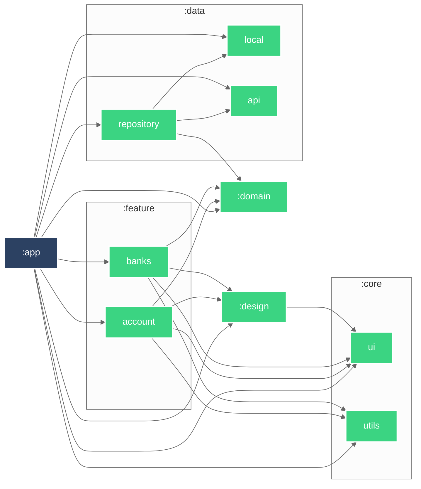

# Module Graph

# About

CATS - 2025

- Case study can be found in the repository: [docs/test_mobile_CA.pdf](test_mobile_CA.pdf)
- Project planning can be found too: [docs/project_planning.png](project_planning.png)