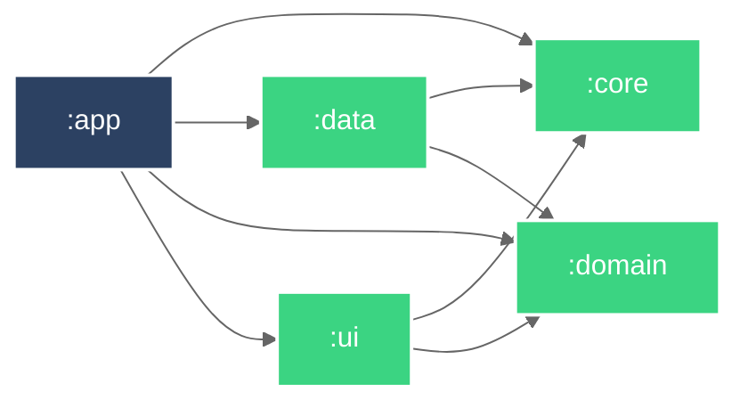

# Module Graph

```mermaid
%%{
  init: {
    'theme': 'neutral'
  }
}%%

graph LR
  :ui --> :core
  :ui --> :domain
  :app --> :core
  :app --> :data
  :app --> :domain
  :app --> :ui
  :data --> :core
  :data --> :domain

classDef android-library fill:#3BD482,stroke:#fff,stroke-width:2px,color:#fff;
classDef android-application fill:#2C4162,stroke:#fff,stroke-width:2px,color:#fff;
class :ui android-library
class :core android-library
class :domain android-library
class :app android-application
class :data android-library

```
# About

CATS - Technical Test 2025

Case study can be found in the repository: [docs/test_mobile_CA.pdf](test_mobile_CA.pdf)
